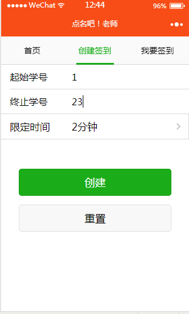
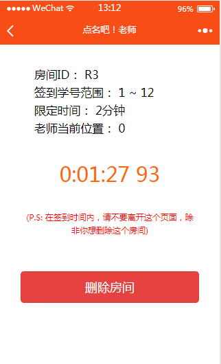
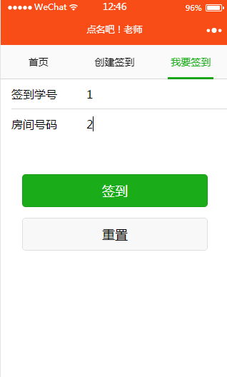
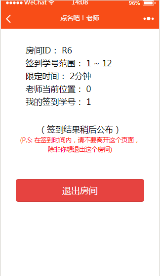
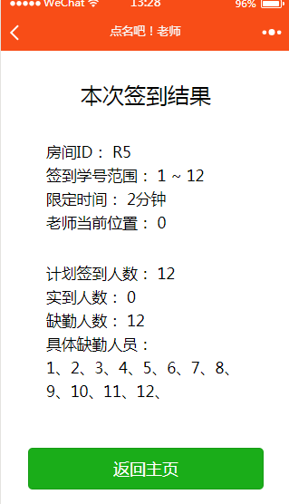
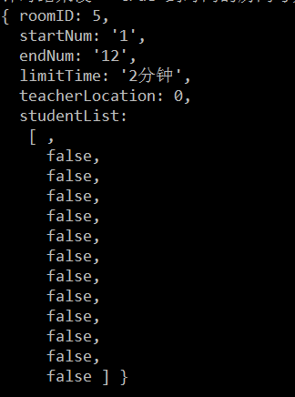

# 点名吧！老师

## 名称：

点名吧老师

## 二维码：

## 创新点：

这个小程序是一个和点名有关的小程序。目的是解决老师上课点名麻烦的需求。用了这个小程序，老师就可以不用一个个名字的去点，这样就可以节省上课时间还有避免了念错名字的尴尬。

1. 老师在上课的某一个时间点，登录小程序，创建一个“签到房间”，设置好学号范围（如1班1号到1班40号就可以设成101~140），然后设置点名的限定时间（例如想要在3分钟之内完成点名，就设3分钟）。
2. 学生登录小程序，然后查找到老师创建的那个点名房间的“房间号”，进入房间以后输入自己的学号（例如1班1号就输入101），点击“签到”按钮进行尝试签到。
3. 学生成功签到的条件：
	- 学生输入的学号不能超出老师所设置的学号范围
	- 学生签到的时间不能超出老师所设置的限定时间
	- 学生签到时，学生手机的距离和老师手机的距离不能大于50米

4. 签到时间结束后，显示签到结果。

## 小程序界面截图：

服务器截图

